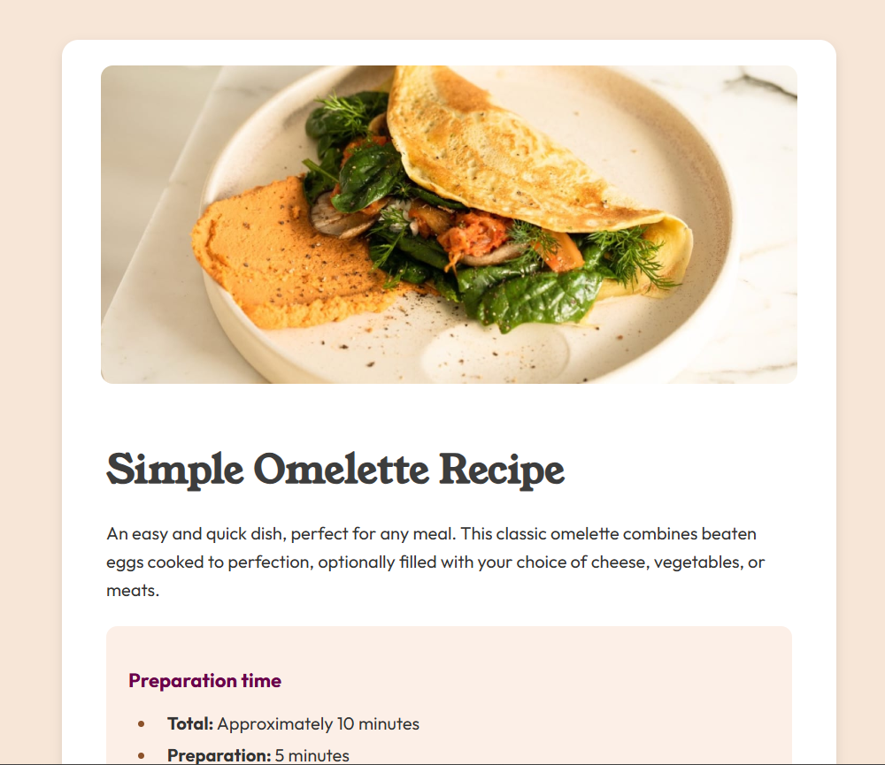

# Frontend Mentor - Recipe page solution

This is a solution to the [Recipe page challenge on Frontend Mentor]

## Table of contents

  - [Screenshot](#screenshot)
  - [Links](#links)
  - [Built with](#built-with)
- [Author](#author)

### Screenshot

### Links

- Solution URL: https://github.com/priyanka-1994/Frontend-mentor-challenges/tree/master/Recipe-page
- Live Site URL: https://priyanka-1994.github.io/Frontend-mentor-challenges/Recipe-page/

### Built with

- Semantic HTML5 markup
- CSS custom properties
- Flexbox

## Author

- Frontend Mentor - @priyanka-1994